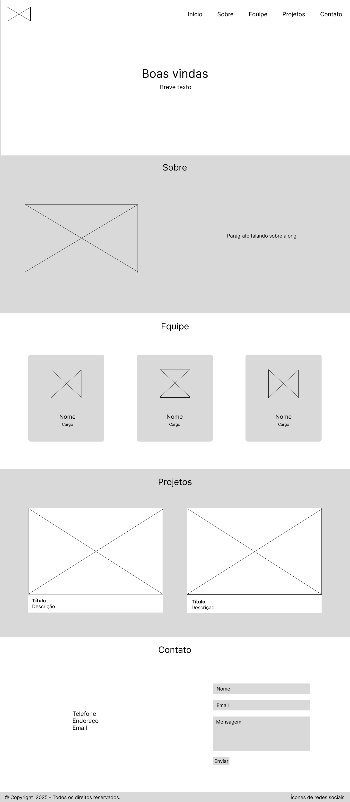

# Trabalho Prático - Semana 03

Dessa vez, vamos escolher uma proposta de projeto para trabalhar.

Nessa atividade, você deverá montar a página inicial do projeto escolhido, a organização do HTML aplicando semântica correta e uso aprimorado do CSS. Leia o enunciado completo no Canvas para mais detalhes.

**IMPORTANTE:** Você deve trabalhar e alterar apenas arquivos dentro da pasta **`public`**. Deixe todos os demais arquivos e pastas desse repositório inalterados. **PRESTE MUITA ATENÇÃO NISSO.**

## Informações Gerais

- Nome: Rafael Henrique de Oliveira Cruz
- Matricula: 904213
- Proposta de projeto escolhida: Organizações e Equipes
- Breve descrição sobre seu projeto: Desenvolvimento de um site para uma ONG de proteção ambiental, com o objetivo de divulgar suas ações e projetos, apresentar a equipe responsável e facilitar a comunicação com apoiadores e voluntários.

## Print do(s) wireframe(s) criado

## Print da home-page criada

<<  COLOQUE A IMAGEM AQUI >>
